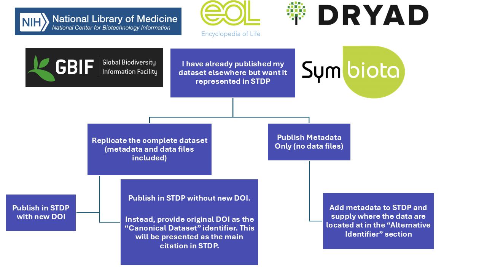

# Frequently Asked Questions
## General Questions
### Will you take my data?
In short, yes. The mission of the Smithsonian Tropical Data Portal is to help the international community preserve, share, and discover tropical data and other research products including protocols, code, reports, and presentations. We aim to help make past, current, and future tropical datasets accessible by providing resources for documentation, management, storage, and visualization of tropical research data. 

### How do I create an account with STDP to upload data?
Check out our [User Registration](register_to_submit/) help documentation to get started with uploads.

### I'm having trouble logging in with my ORCID.
If login is not working, please try one or all of our [login troubleshooting tips](login_troubleshooting/). Contact `WhiteA@si.edu` or `BrissetteL@si.edi` if problems persist.

### What is a Data Package?
The Smithsonian Research Data Repository primarily archives data packages. Data packages are simply defined as a collection of related data and metadata files. Each data package should contain, when possible, all of the relevant data and metadata from a specific research project (or sub-project/project component). Depending on the size of a research project, multiple data packages may be associated with a single research project. 

For example, if a research project consists of field sampling at several distinct sites or over several distinct sampling seasons, each site/season may have its own unique data package. When submitting to the Smithsonian Tropical Data Portal, it is up to the best judgement of the submitting researcher how their research should be grouped.

### What if I have already published my data in Dryad, NCBI, GBIF, etc.?

If your data has already been published in another repository, specialty or not, we still invite you to publish in the STDP. There are a few options that you may consider if you find youself in this situation (Figure 1)

Publishing a dataset or its metadata in an additional repository—even if previously published—enhances data discoverability and longevity. As part of the DataOne federation, STDP adheres to FAIR principles, ensuring that your data is easily Findable through persistent identifiers, Accessible via standardized web services, Interoperable with common data formats, and Reusable with rich metadata. This additional archiving not only broadens the dataset’s reach but also reinforces data integrity, promotes reproducibility, and facilitates collaboration within the tropical scientific community.

  <figure>
    
    <figcaption align="center" style="font-size: 0.9em;">Figure 1. Options for placing previously published datasets in STDP</figcaption>
  </figure>

## Search FAQ
### Why can’t I see all the Smithsonian Figshare historical data here?
STDP is working on the transition of historical tropical data from <a href="https://smithsonian.figshare.com" target="_blank">Smithsonian Figshare</a> to the STDP. Smithsonian Figshare is still active and while the current plan is to have all newly published tropical research data avaiable through the STDP, the transition will be a gradual one. If you have any questions about the Smithsonian Research Data Repository, the Smithsonian Tropical Data Portal,  or the data transition, please contact `WhiteA@si.edu`.

### Why can’t I see the data I uploaded in the dataset listing?
Check if you are logged in. If you haven’t Published your dataset, then it will only be visible, privately to you, once you are logged in.

## Upload FAQ
## What is a good dataset?
To see an example of a good dataset, visit these packages on STDP: 

* <a href="https://smithsonian.dataone.org/view/doi%3A10.60635%2FC31609" target="_blank">Full Data Package Example 1</a> 
  
* <a href="https://smithsonian.dataone.org/view/doi%3A10.60635%2FC3RG6V" target="_blank">Full Data Package Example 2</a>
  
* <a href="https://smithsonian.dataone.org/view/urn%3Auuid%3A66a18bfe-0a6b-4ab0-9eb7-f1276cace9e5" target="_blank">Metadata Package Example</a>

If you would like to reference other datasets that have been reviewed and published in the STDP, visit https://smithsonian.dataone/data and explore the list of published datasets.

### What metadata do you need to submit a dataset?

Metadata are ultimately "data about data" - the contextual information needed to interpret a set of raw data observations. They provide meaning to data, and are critical when it comes to sharing, integrating, and analyzing data. Too often people collect data for projects and leave them undocumented for years or decades. These data, while potential of very high value, can become useless over time due to data entropy.

At a high level, we are looking for metadata about what the dataset is about (e.g. title, description, keywords, funding), and author information. Check out [this page](/submit_online/) to preview the submission form to get a sense of the types of metadata a dataset needs. 

To understand the Smithsonian Tropical Data Portal's expectations for metadata content, see our [Package Level Metadata Guide](/package_level_meta_reqs/) and [File Level Metadata Guide](/file_level_metadata/) for details.

*To help other users have a thorough understanding of your dataset, you might consider adding all of the metadata applicable to your project, as outlined below.* 

The goal of metadata is to document a project's output so that a reasonable scientist will be able to understand and use all the components of the output without any outside consultation. The following components represent a non-exhaustive list of components typically expected within metadata records submitted to the STDP:

* A descriptive title that includes the topic, geographic location, dates, and, if applicable, the scale of the data.
* A descriptive data package abstract that provides a brief overview summarizing the specific contents and purpose of the data package.
* Funding information, if applicable.
* A list of all people or organizations associated with the data package with at least one person or organization acting as a creator and one acting as a contact (these can be the same).
* Full records of field and laboratory sampling times and locations, including a geographic description interpretable by a general scientific audience.
* Full records of taxonomic coverage within the data package (if applicable).
* Full descriptions of field and laboratory sample collection methods.
* Full descriptions of field and laboratory sample processing methods.
* Full descriptions of any hardware and software used (including make, model, and version where applicable).
* Full attribute/variable information for all data.
* Quality control procedures.
* Relevant explanations for why the particular components detailed above were chosen for the project.

### What File Formats are acccepted?

While STDP supports the upload of any data file format, sharing data can be greatly enhanced  if you use ubiquitous, easy-to-read formats. For instance, while Microsoft Excel files are commonplace, it's better to export these spreadsheets to Comma Separated Values (CSV) text files, which can be read on any computer without having Microsoft products installed.

For image files, use common formats like PNG, JPEG, TIFF, etc. Most all browsers can handle these. If you use specialized software to create your data, try to save you data in well-known formats. For instance, GIS data can be exported to ESRI shapefiles, and data created in Matlab or other matrix-based programs can be exported as NetCDF (an open binary format).

### What happens after I "Save Dataset"?
The dataset will be entered into the STDP system, and will only be visible to you, and those that you share the data package with, privately until you [Publish](/submit_online/#publication_options/) the data. You can continue to Edit the record after you submit.

### What are my data package publication options?
Please review the [publication options](/submit_online/#publication-options) to make your new or previously existing dataset(s) and/or metadata publications available through the Smithsonian Tropical Data Portal. If you have any questions regarding the process, please feel free to reach out to `BrissetteL@si.edu`

### What if my data upload is failing?
Uploading large amounts of data can be really difficult on home internet connections. We recommend taking the following steps: 

* Upload files one at a time and save after each upload is complete to ensure that the changes are properly saved.

* Go to your computer’s battery settings and turn off sleep mode. If your system goes to sleep in the middle of an upload it can stop the process and prevent the changes from saving.

* Please contact ess-dive-support@lbl.gov should the upload issue persist.

* Additionally, you may want to consider using Globus to workaround upload errors. Globus is a third-party data transfer tool that ESS-DIVE commonly uses to support large or difficult file uploads. Learn more on our <a href="https://smithsonian.dataone.org/portals/tropical/Globus" target="_blank">Globus documentation page</a>.

## Other

### What are the Liscening and Data Distribution terms for datasets added into STRP?

All data and metadata will be released under either the <a href="https://creativecommons.org/publicdomain/zero/1.0/" target="_blank">CC-0 Public Domain Dedication</a> or the <a href="https://creativecommons.org/licenses/by/4.0/" target="_blank">Creative Commons Attribution 4.0 International License</a>. In cases where legal (e.g., contractual) or ethical (e.g., human subjects) restrictions to data sharing exist, it is incumbent on the researcher to ensure compliance with all federal, university, and Institutional Review Board policies, so as to not publish sensitive data. As a repository dedicated to helping researchers increase collaboration and the pace of science, this repository needs certain rights to copy, store, and redistribute data and metadata. By uploading data, metadata, and any other content to the KNB, users warrant that they own any rights to the content and are authorized to do so under copyright or any other right that might pertain to the content. <a href="https://www.bitlaw.com/copyright/database.html" target="_blank">Data and facts themselves are not covered under copyright</a> in the US and most countries, since facts in and of themselves are not eligible for copyright. That said, some associated metadata and some particular compilations of data could potentially be covered by copyright in some jurisdictions. 

**By uploading content, users grant the STDP repository and the Smithsonian all rights needed to copy, store, redistribute, and share data, metadata, and any other content. By marking content as publicly available, users grant the STDP repository, the Smithsonian, and any other users the right to copy the content and redistribute it to the public without restriction under the terms of the <a href="https://creativecommons.org/publicdomain/zero/1.0/" target="_blank">CC-0 Public Domain Dedication</a> or the <a href="https://creativecommons.org/licenses/by/4.0/" target="_blank">Creative Commons Attribution 4.0 International License</a>, depending on which license users choose at the time of upload.**