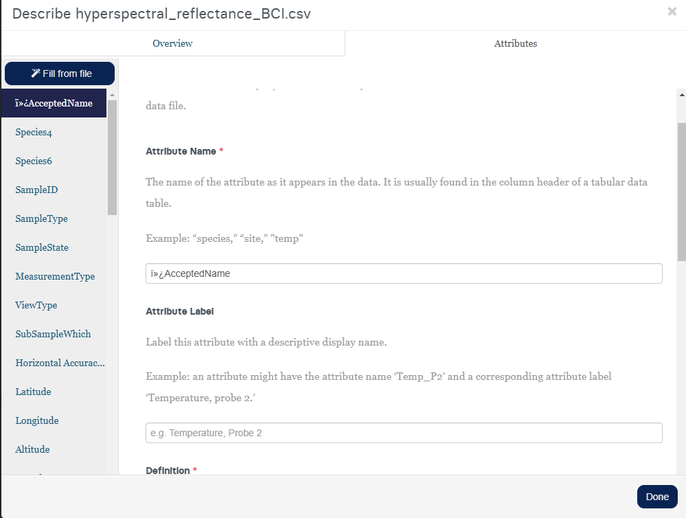

# **File Level Metadata Guidelines**

Metadata are ultimately "data about data" - the contextual information needed to interpret a set of raw data observations. They provide meaning to data, and are critical when it comes to sharing, integrating, and analyzing data. Too often people collect data for projects and leave them undocumented for years or decades. These data, while potential of very high value, can become useless over time due to data entropy.

The STDP primarily stores metadata in a structured, XML-based files. Ideally, plans to create and store metadata records should be made during the initial stages of project development (i.e., within the data management plan of the project proposal). 

If you would like guidance in forming Data Management Plans, and other tools to help manage your research data, the Smithsonian Library has available resources published here: 
<a href="https://library.si.edu/research/manage-research-data" class="button">Manage Research Data</a>

<a href="https://library.si.edu/research" class="button">Smithsonian Library Research Tools</a>

## **Describe the data in your files**
### **Within the portal user interface**

The portal will prompt you to describe each of your columns of each of your tabular files. 

For this reason, it is recommended that tabular data is submitted in a long (versus wide) format if possible. Learn more about long versus wide <a href="https://www.statology.org/long-vs-wide-data/" target="_blank">in this article "Long vs. Wide Data: What’s the Difference?"</a> or <a href="https://www.youtube.com/watch?v=-3P6QzdMRZ0" target="_blank">this video "Tidy Data, Wide Data & Long Data"</a>. 

Long file formats can make documentation of column attributes (variables) much easier, and it will allow future users of the data to more easily process the data programmatically. However, it is up to the user on how they prefer to format their data, STDP accepts both long and wide formatted data. 

For each applicable column of each table, please provide:

* the attribute name (as used in the table)
* attribute label  (a descriptive display name, e.g. Temp_p2 = Temperature, probe 2)
* an attribute definition (unformatted text)
* a missing value indicator
* a category type
* units of measurement, if applicable 

**Our web portal offers users the option to notate metadata in a point and click fashion.** 

After the file has been uploaded, users can "Describe" their data (Figure 1). 

  <figure>
    
    <figcaption align="center" style="font-size: 0.9em;">Figure 1. Describe Dataset Attributes in Portal</figcaption>
  </figure>

This will open a pop-up where the user can provide a brief description of the file and its contents and where the user can start to notate the attribute (variable) specific information (Figure 2). There is an option to manually add the column names or use the "Fill from File" feature (Figure 3).

  <figure style="margin-right: 10px; text-align: center; width: 100%;">
    
    <figcaption style="font-size: 0.9em;">Figure 2: File Description and Attributes Pop-up</figcaption>
  </figure>

  <figure style="text-align: center; width: 100%;">
    
    <figcaption style="font-size: 0.9em;">Figure 3: List Columns Manually or use 'Fill from file' feature.</figcaption>
  </figure>

Once the column(s) are listed, you can now add the attribute level details and edit any fields that may have auto-imported incorrectly. Those with red asterisks* are required fields. (Figure 4)

#### <strong>Attribute Name *</strong> (Figure 4)

  <figure style="text-align: center; width: 100%;">
    
    <figcaption style="font-size: 0.9em;">Figure 4: Review the auto-filled Attribute Name information.</figcaption>
  </figure>

#### **Attribute Label** and <strong>Definition of Variable *</strong> (Figure 5)

  <figure style="text-align: center; width: 100%;">
    
    <figcaption style="font-size: 0.9em;">Figure 5: Define optional Attribute Label and Required brief Definition of the variable.</figcaption>
  </figure>

#### <strong>Category *</strong> (Figure 6)
    
* Ordered or Unordered Category (specify possible values*) (Figure 7)
* Numeric (specify the unit*) (Figure 8)
* Date-time (specify the date-time format*) (Figure 8)
* Missing Value Codes (if applicable, specify the code used and its definition) (Figure 9)

  <figure style="text-align: center; width: 100%;">
    
    <figcaption style="font-size: 0.9em;">Figure 6: Define the category type for your variable.</figcaption>
  </figure>

  <figure style="text-align: center; width: 100%;">
    
    <figcaption style="font-size: 0.9em;">Figure 7: Possible Values for Unordered or Ordered Categories.</figcaption>
  </figure>

  <figure style="text-align: center; width: 100%;">
    
    <figcaption style="font-size: 0.9em;">Figure 8: Date-time Format.</figcaption>
  </figure>

  <figure style="text-align: center; width: 100%;">
    
    <figcaption style="font-size: 0.9em;">Figure 9: Define Missing Value indictor and explanation.</figcaption>
  </figure>

After you have finished describing your dataset, you can select the "Done" button in the bottom left corner. You should receive a green checkmark, indicating you have completed all required fields (Figure 4). If you get a red exclamation mark, this indicates that you may have missed a field and need to return to complete the descriptions (Figures 5 and 6). 

  <figure style="text-align: center; width: 100%;">
    
    <figcaption style="font-size: 0.9em;">Figure 10: A green check mark indicates that all required fields have been completed.</figcaption>
  </figure>

  <figure style="text-align: center; width: 100%;">
    
    <figcaption style="font-size: 0.9em;">Figure 11: A red exclamation point indicates that one or more required fields have been missed.</figcaption>
  </figure>

  <figure style="text-align: center; width: 100%;">
    
    <figcaption style="font-size: 0.9em;">Figure 12: Red exclamation points indicate which columns need attention.</figcaption>
  </figure>

### **Within a set of descriptive documents**

Alternatively, you can attach additional documentation that helps to describe your data. This can include a **README** document, **Data Dictionary**, and some sort of **Categorical Codebook**, if applicable. 

Functionally, this will capture the same information that would have otherwise been noted in the portal interface but is now added as a user friendly set of descriptive files.  It is useful to create a data dictionary to describe your tabular data and accompany deposit in a repository so that others can interpret and reuse your data.

#### Example data packages that use a set of descriptive documents 

<a href="https://smithsonian.dataone.org/view/doi%3A10.60635%2FC37W2T" target="_blank">Example Data Package that uses a set of descriptive documents to notate metadata.</a>

<a href="https://smithsonian.dataone.org/view/doi%3A10.60635%2FC31609" target="_blank">Example Data Package that uses a set of descriptive documents and the portal's interface to notate metadata.</a>

#### What is a Data Dictionary?

    <strong>Definition:</strong> A document that outlines the structure, content, and variable definitions for a dataset or collection of data.

Open Science Framework provides a nice resource to learn more <a href="https://help.osf.io/article/217-how-to-make-a-data-dictionary" target="_blank">How to Make a Data Dictionary</a>

#### What is a Categorical Codebook?

    <strong>Definition:</strong>  A document or table that provides definitions and explanations for categorical variables used in a dataset. It helps users understand the meaning of coded values (such as abbreviations, numeric codes, or labels) assigned to categorical data.

At the least, a categorical codebook should include:

* Column name
* Category
* Definition
* Source (which file the category is used in)
 
#### Templates

* ReadME
    * <a href="../README_template.txt" download>Download Template</a>
    * <a href="../README_completed_example_1.txt" download>Example 1 Completed README</a>
    * <a href="../README_completed_example_2.pdf" download>Example 2 Completed README</a>
    * <a href="../README_AllInOne_template.txt" download>Download ALL-IN-ONE README + Data Dictionary + Categorical Codebook Template</a>
* Data Dictionary
    * <a href="../Data_dictionary_template.csv" download>Download Template</a>
    * <a href="../Data_dictionary_example.csv" download>Example Completed Data Dictionary</a>
* Categoical Codebook
    * <a href="../Categorical_Codebook_template.csv" download>Download Template</a>
    * <a href="../Categorical_codebook_example.csv" download>Example Completed Categorical Codebook</a>