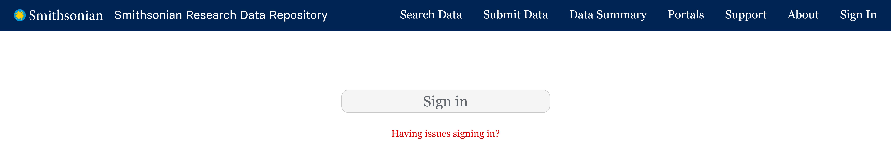
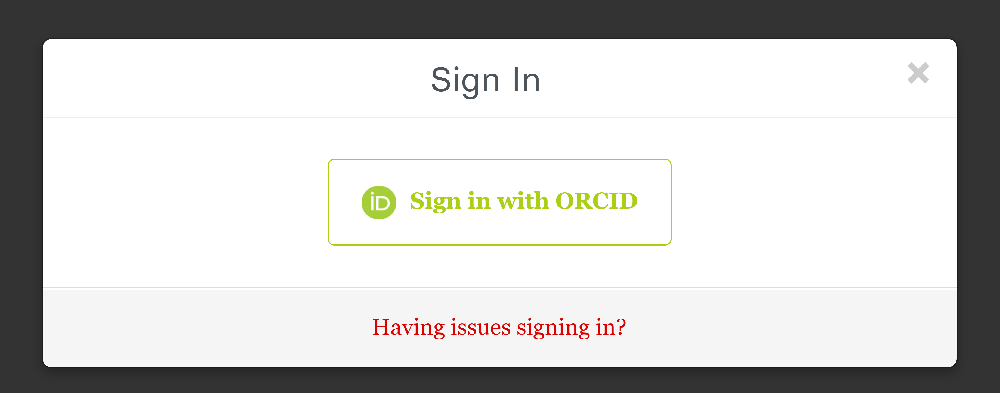

# How to Submit Data with Online Form in the STDP

This comprehensive tutorial will guide you through the process of creating and submitting a private dataset to the Smithsonian Tropical Research Data Repository.

**Please ensure that there is no Protected information (PII or SPII) in your dataset.**

## Preferred Browsers

* Chrome
* Firefox
* Note: You may experience some issues with Safari and Microsoft Edge.

These instructions assume you have been given access to upload data by a Smithsonian Data Repository admin. If you are logging in for the first time, see documentation on how to set up your account to get access to upload.

## Access the Data Submission Web Form

**Click the link to the data submission web form: [https://smithsonian.dataone.org](https://smithsonian.dataone.org/submit)**

This link will take you to a sign in screen where you can use your ORCID credentials to sign in. (Figure 1)

You will then be prompted to sign in with your ORCID credentials. (Figure 2)

Once you click on the "Sign in with ORCID" button, the system will redirect you to a login screen. You can also link your ORCID with your Institutional account if you prefer to login that way. If you do not have an ORCID account, you can create one at: https://orcid.org/register.

[INSERT FIGURE 3: ORCID default login page]

## Instructions to Create a New Dataset/Data Package

1. Once you are logged in, click on the "Submit Data" button next to the "Search Data" button at the top of the page. You can also find a "Submit Data" button under your profile name in the left corner of the page.

2. Add your files in the top section to start your dataset submission.

3. Enter all the fields in the various tabs. While you only need to fill in required fields (marked with a *) to submit a record, we recommend that you fill as many of the fields as possible so users can more easily locate your dataset and understand what it contains.

[INSERT FIGURE 4: Section to add files]

### Section Overview

#### Overview Tab
[INSERT FIGURE 5: Overview Section]

#### People Tab
[INSERT FIGURE 6: People Section]

#### Dates Tab
[INSERT FIGURE 7: Dates Section]

#### Locations Tab
[INSERT FIGURE 8: Locations Section]

#### Methods Tab
[INSERT FIGURE 9: Methods Section]

## Save the Dataset

When complete, hit the "Save Dataset" button at the bottom of your screen. This will save the record as a private dataset/data package.

[INSERT FIGURE 10: Save Dataset button]

When you save your dataset it will remain private.

### View your submission

If your submission is successful, you will see a confirmation message. Click on the "View your Dataset" button.

[INSERT FIGURE 11: A Successful Save Dataset/Submission Message]

Your browser will prompt you with a message asking "Leave this page? All of your unsaved changes will be lost." Don't worry! Since you just clicked the "Save Dataset" button, your changes have been saved. You can safely proceed by clicking "Okay".

[INSERT FIGURE 12: Browser prompt to leave page]

Here you can review your data package and verify that your dataset details are entered correctly. If you run into any problems, send an email to the data team when you are done with your submission and would like it to be reviewed before making it public.

[INSERT FIGURE 13: Dataset Landing Page]

### Important Details to Note

1. **Private Dataset Indicator**
   * The orange circle with a lock indicates that this dataset is Private
   * Only you, individuals with shared access, and the admin team can view private datasets
   * Datasets can remain "Private" throughout the drafting and review process

2. **Publication Status**
   * The top right corner shows the dataset as "Published" with the publication date
   * This indicates successful submission and assignment of a unique identifier (urn:uuid: xxx)
   * While private, the public cannot access this dataset

3. **Publication Options**
   
   Our repository offers two levels of data publication for the public:

   **Option 1: Publish with DOI**
   * Provides a persistent, globally recognized identifier
   * Supports formal data publication and citation
   * Makes datasets discoverable through DOI registries
   * Click "Publish with DOI" on the dataset's landing page
   * New DOI assigned for significant updates

   [INSERT FIGURE 14: Citation with DOI]

   **Option 2: Publish with URN:UUID**
   * Uses system's automatically generated unique identifier
   * New URN:UUID assigned with each update
   * Suitable for data already published elsewhere
   * Makes data searchable within the Smithsonian portal

   [INSERT FIGURE 15: Citation with URN:UUID]

To make data public with URN:UUID:
1. Click the edit button on the dataset's landing page
2. Click each "Share" button
3. Toggle sharing permissions from "Private" to "Public"
4. Save changes
   
[INSERT FIGURE 16: Public and Private Access Permissions]

## Instructions to Edit an Existing Dataset

Click on the Edit Button on your dataset's landing page. This will take you to the form where you previously entered your metadata and uploaded data files.

[INSERT FIGURE 17: Edit Dataset]
