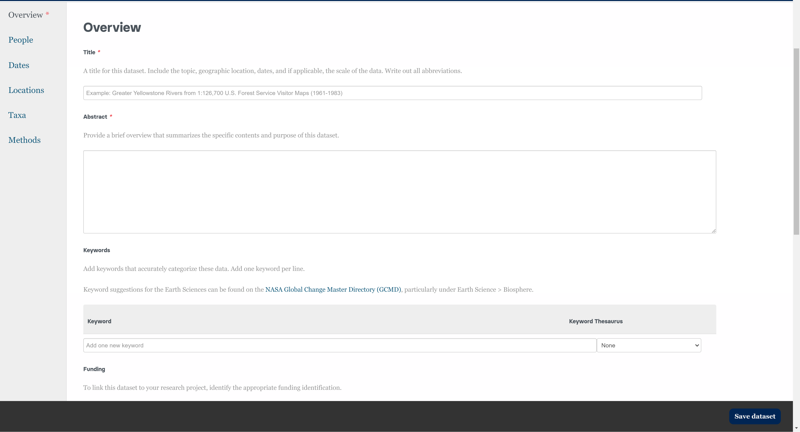
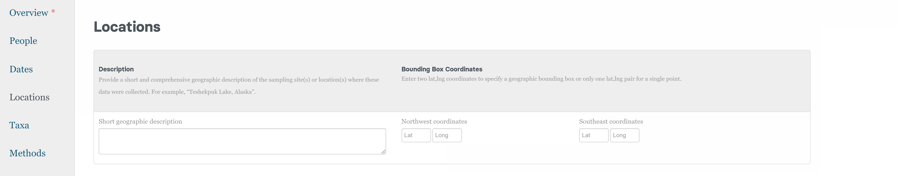

# How to Submit Data with Online Form in the STDP

This comprehensive tutorial will guide you through the process of creating and submitting a private dataset to the Smithsonian Tropical Research Data Repository.

**Please ensure that there is no Protected information (PII or SPII) in your dataset.**

## Preferred Browsers

* Chrome
* Firefox
* Note: You may experience some issues with Safari and Microsoft Edge.

These instructions assume you have been given access to upload data by a Smithsonian Data Repository admin. If you are logging in for the first time, see documentation on how to set up your account to get access to upload.

## Access the Data Submission Web Form

**Click the link to the data submission web form: [https://smithsonian.dataone.org](https://smithsonian.dataone.org/submit)**

This link will take you to a sign in screen where you can use your ORCID credentials to sign in. (Figure 1)

Figure 1. Sign in page for data uploads

You will then be prompted to sign in with your ORCID credentials. (Figure 2)

Figure 2. ORCID sign in page for data uploads

Once you click on the "Sign in with ORCID" button, the system will redirect you to a login screen (Figure 3). You can also link your ORCID with your Institutional account if you prefer to login that way. If you do not have an ORCID account, you can create one at: https://orcid.org/register, or visit our page on Creating an ORCID.

Figure 3. ORCID default login page

## Instructions to Create a New Dataset/Data Package

1. Once you are logged in, click on the "Submit Data" button next to the "Search Data" button at the top of the page. You can also find a "Submit Data" button under your profile name in the left corner of the page.

2. Add your files in the top section to start your dataset submission.

3. Enter all the fields in the various tabs (Figure 4). While you only need to fill in required fields (marked with a *) to submit a record, we recommend that you fill as many of the fields as possible so users can more easily locate your dataset and understand what it contains.

Figure 4: Section to add files

### To review the expectations for content in sections 1-5, refer to our Package Level Metadata Guide.

#### Overview Tab

Figure 5: Overview Section

#### People Tab

Figure 6: People Section

#### Dates Tab

Figure 7: Dates Section

#### Locations Tab

Figure 8: Locations Section

#### Methods Tab

Figure 9: Methods Section

## Save the Dataset

When complete, hit the "Save Dataset" button at the bottom of your screen(Figure 10). This will save the record as a private dataset/data package.

Figure 10: Save Dataset button

When you save your dataset it will remain private.

### View your submission

If your submission is successful, you will see a confirmation message (Figure 11). Click on the "View your Dataset" button.

Your browser will prompt you with a message asking "Leave this page? All of your unsaved changes will be lost."(Figure 12) Don't worry! Since you just clicked the "Save Dataset" button, your changes have been saved. You can safely proceed by clicking "Okay".

Figure 12: Browser prompt to leave page

Here you can review you data package and verify that your dataset details are entered correctly (Figure 13). If you run into any problems, send an email to BrissetteL@si.edu or WhiteA@si.edu, with the error message you received. Notify the data team BrissetteL@si.edu when you are done with your submission and would like it to be reviewed before making it public.

Figure 13: Dataset Landing Page

### Important Details to Note

1. **Private Dataset Indicator**
   * **The orange circle with a lock indicates that this dataset is Private**
   * Only you, individuals with shared access, and the admin team can view private datasets
   * Datasets can remain "Private" throughout the drafting and review process, or for a prolonged amount of time as if to embargo the data.

2. **Publication Status**
   * In the top right corner, you will see the dataset listed as “Published” along with the publication date. This indicates that it was successfully submitted and published to the repository, and it was given a unique identifier (urn:uuid: xxx) in the repository’s system.
   * **Since the dataset it still set to Private, the public does not have access to this dataset.**

3. **Publication Options**
   
   Our repository offers two levels of data publication for the public:

   **Option 1: Publish with DOI**
      
      * DOI is a persistent, globally recognized identifier designed for formal data publication and citation. Using a DOI supports findability and accessibility by making datasets discoverable through DOI registries.

      * To publish your dataset with a DOI, click the "Publish with DOI" button on the right-hand side of the dataset's landing page. Your dataset will also be assigned a DOI and a persistent link.

      * If you make significant or minor edits after it has been published with a DOI and save those changes, the system will assign a new URN:UUID to the dataset. To republish the updated dataset with a DOI, you will need to click “Publish with DOI” again. This will assign a new, unique DOI to the updated dataset.  The citation will be formatted as follows: 

         
   
Figure 14: Citation with DOI

   **Option 2: Publish with URN:UUID**
   * To publish your dataset with the system's automatically generated unique identifier (URN:UUID). If edits are made, large or small, and the dataset is saved again, a new URN:UUID will be assigned to the dataset. The citation will be formatted as follows: 

      
   
Figure 15: Citation with URN:UUID

     * This may be a good option if this dataset it is already published in a different specialty repository or was published years ago and you would like to make the data or metadata searchable and findable within the Smithsonian Tropical Research Data Repository portal. You can also notate any alternative identifiers in the Overview Section metadata. 
     
         To make data public with URN:UUID (Figure 16):
         1. Click the edit button on the dataset's landing page
         2. Click each "Share" button
         3. Toggle sharing permissions from "Private" to "Public"
         4. Save changes 
   
         
   
Figure 16: Public and Private Access Permissions

## Instructions to Edit an Existing Dataset

Click on the Edit Button on your dataset's landing page. This will take you to the form where you previously entered your metadata and uploaded data files.

Figure 17: Edit Dataset
