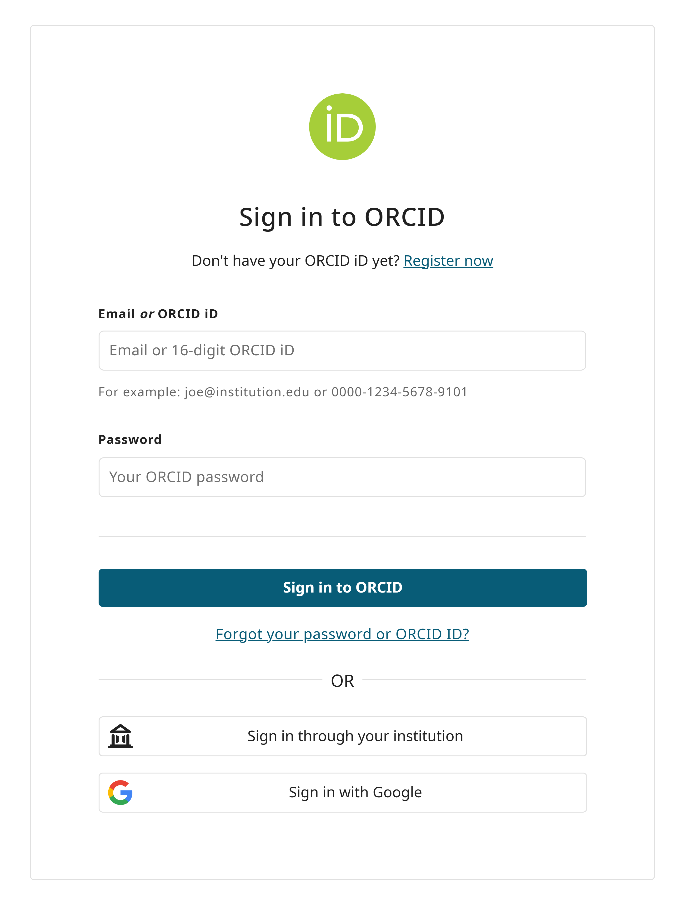
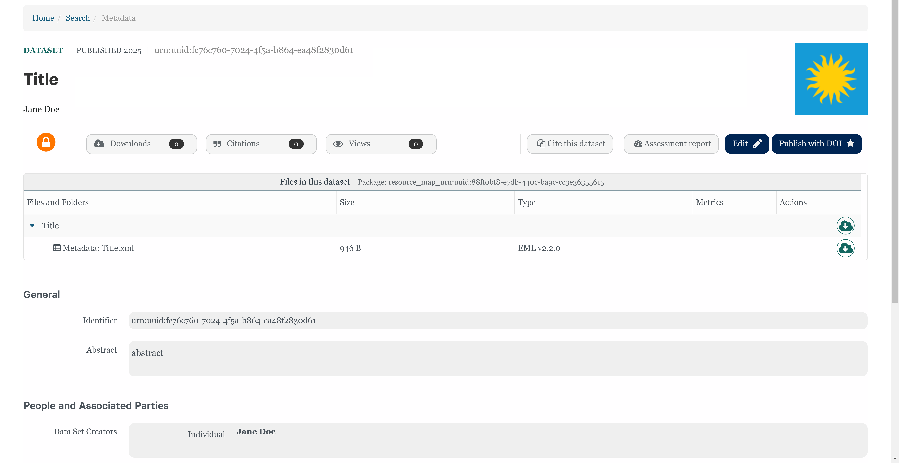

# How to Submit Data with Online Form in the STDP

This comprehensive tutorial will guide you through the process of creating and submitting a private dataset to the Smithsonian Tropical Research Data Repository.

**Please ensure that there is no Protected information (PII or SPII) in your dataset.**

## Preferred Browsers

* Chrome
* Firefox
* Note: You may experience some issues with Safari and Microsoft Edge.

These instructions assume you have been given access to upload data by a Smithsonian Data Repository admin. If you are logging in for the first time, see documentation on how to set up your account to get access to upload.

## Access the Data Submission Web Form

**Click the link to the data submission web form: <a href="https://smithsonian.dataone.org/submit" target="_blank">https://smithsonian.dataone.org</a>**

This link will take you to a sign in screen where you can use your ORCID credentials to sign in. (Figure 1)

  <figure>
    
    <figcaption align="center" style="font-size: 0.9em;">Figure 1. Sign in page for data uploads</figcaption>
  </figure>

You will then be prompted to sign in with your ORCID credentials. (Figure 2)

  <figure>
    
    <figcaption align="center" style="font-size: 0.9em;">Figure 2. ORCID sign in page for data uploads</figcaption>
  </figure>

Once you click on the "Sign in with ORCID" button, the system will redirect you to a login screen (Figure 3). You can also link your ORCID with your Institutional account if you prefer to login that way. If you do not have an ORCID account, you can create one at: <a href="https://orcid.org/register" target="_blank">ORCID Registration</a>, or visit our page on Creating an ORCID.

  <figure>
    
    <figcaption align="center" style="font-size: 0.9em;">Figure 3. ORCID default login page</figcaption>
  </figure>

## Instructions to Create a New Dataset/Data Package

1. Once you are logged in, click on the "Submit Data" button next to the "Search Data" button at the top of the page. You can also find a "Submit Data" button under your profile name in the left corner of the page.

2. Add your files in the top section to start your dataset submission.

3. Enter all the fields in the various tabs (Figure 4). While you only need to fill in required fields (marked with a *) to submit a record, we recommend that you fill as many of the fields as possible so users can more easily locate your dataset and understand what it contains.

  <figure>
    
    <figcaption align="center" style="font-size: 0.9em;">Figure 4: Section to add files</figcaption>
  </figure>

#### To review the expectations for content in sections 1-5, refer to our [**Package Level Metadata Guide**](../package_level_meta_reqs/).

## Sections

#### **Overview Tab**

  <figure>
    
    <figcaption align="center" style="font-size: 0.9em;">Figure 5: Overview Section</figcaption>
  </figure>

#### **People Tab**

  <figure>
    
    <figcaption align="center" style="font-size: 0.9em;">Figure 6: People Section</figcaption>
  </figure>

#### **Dates Tab**

  <figure>
    
    <figcaption align="center" style="font-size: 0.9em;">Figure 7: Dates Section</figcaption>
  </figure>

#### **Locations Tab**

  <figure>
    
    <figcaption align="center" style="font-size: 0.9em;">Figure 8: Locations Section</figcaption>
  </figure>

#### **Methods Tab**

  <figure>
    
    <figcaption align="center" style="font-size: 0.9em;">Figure 9: Methods Section</figcaption>
  </figure>

## Save the Dataset

When complete, hit the "Save Dataset" button at the bottom of your screen(Figure 10). This will save the record as a private dataset/data package.

  <figure>
    
    <figcaption align="center" style="font-size: 0.9em;">Figure 10: Save Dataset button</figcaption>
  </figure>

When you save your dataset it will remain private.

### View your submission

If your submission is successful, you will see a confirmation message (Figure 11). Click on the "View your Dataset" button.

  <figure>
    
    <figcaption align="center" style="font-size: 0.9em;">Figure 11: A Successful Save Dataset/Submission Message</figcaption>
  </figure>

Your browser will prompt you with a message asking "Leave this page? All of your unsaved changes will be lost."(Figure 12) Don't worry! Since you just clicked the "Save Dataset" button, your changes have been saved. You can safely proceed by clicking "Okay".

  <figure>
    
    <figcaption align="center" style="font-size: 0.9em;">Figure 12: Browser prompt to leave page</figcaption>
  </figure>

Here you can review you data package and verify that your dataset details are entered correctly (Figure 13). If you run into any problems, send an email to `BrissetteL@si.edu` or `WhiteA@si.edu`, with the error message you received. If you would like your data package reviewed before making it public, please reach out to `BrissetteL@si.edu`.

  <figure>
    
    <figcaption align="center" style="font-size: 0.9em;">Figure 13: Dataset Landing Page</figcaption>
  </figure>

## **Important Details to Note**

1. **Private Dataset Indicator**
   
    * **The orange circle with a lock indicates that this dataset is Private**
    * Only you, individuals with shared access, and the admin team can view private datasets.
    * Datasets can remain "Private" throughout the drafting and review process, or for a prolonged amount of time as if to embargo the data.

2. **Publication Status**
   
    * In the top right corner, you will see the dataset listed as “Published” along with the publication date. This indicates that it was successfully submitted and posted to the repository, and it was given a unique identifier (urn:uuid: xxx) indexing it in the repository’s system.
    * **Since the dataset it still set to Private, the public does not have access to this dataset.**

## **Publication Options**
   
Our repository offers a few ways to add your data to the repository.

### **Option 1: Publish with DOI**
      
   * DOI is a persistent, globally recognized identifier designed for formal data publication and citation. Using a DOI supports findability and accessibility by making datasets discoverable through DOI registries.

   * To publish your dataset with a DOI, click the "Publish with DOI" button on the right-hand side of the dataset's landing page. Your dataset will also be assigned a DOI and a persistent link.

   * **IMPORTANT NOTE:** If you make ANY edit after the dataset has been published with a DOI and save those changes, the system will assign a new URN:UUID to the dataset. To republish the updated dataset with a DOI, you will need to click “Publish with DOI” again. This will assign a new, unique DOI to the updated dataset.  The citation will be formatted as follows: 

  <figure>
    
    <figcaption align="center" style="font-size: 0.9em;">Figure 14: Citation with DOI</figcaption>
  </figure>

### **Option 2: "Publish" with URN:UUID**
   
   * To publish your dataset with the system's automatically generated unique identifier (URN:UUID). To do this, all you need to do is change the dataset from **Private** to **Public**. Note: If edits are made, large or small, and the dataset is saved again, a new URN:UUID will be assigned to the dataset.

To make data **public**  (Figure 17-18):
  
  1. Click the edit button on the dataset's landing page
  2. Click each "Share" button
  3. Toggle sharing permissions from "Private" to "Public"
  4. Save changes 
   

   <figure style="text-align: center; width: 50%;">
    
    <figcaption>Figure 15: Private Access Permissions</figcaption>
  </figure>
   <figure style="margin-right: 10px; text-align: center; width: 50%;">
    
    <figcaption>Figure 16: Public Access Permissions</figcaption>
  </figure>

The citation will be formatted as follows: 

  <figure>
    
    <figcaption align="center" style="font-size: 0.9em;">Figure 17: Citation with URN:UUID</figcaption>
  </figure>

### Have a Dataset that is published elsewhere but want it represented in the STDP? 
If this dataset is essentially a duplicate of a version stored elsewhere, provide the ID of the original dataset in the [Canonical Dataset](/package_level_meta_reqs/#canonical-dataset) box in the Overview Section. This must be a DOI or URL. Sometimes datasets in the Smithsonian Tropical Data Portal are essentially duplicates of an external dataset that was originally published elsewhere. For example, you may want to preserve a copy of a dataset in STDP for posterity or to ensure that the data remains accessible. In such cases, it is more approprite to cite the original dataset rather than the copy. The canonical version is displayed prominently in a banner on the dataset landing page, making it easy for users to identify the original dataset and cite it correctly (Figure 16). This avoids issues with misrepresentation and citation confusion. 

  <figure>
    
    <figcaption align="center" style="font-size: 0.9em;">Figure 18: How Canonical Datasets will be formated in the STDP.</figcaption>
  </figure>

* Not assigning a DOI may be a good option if the dataset is already stored in a scientifically appropriate repository (e.g., NCBI, GBIF) or was published in another suitable repository before this one was active (e.g., Zenodo, Dryad). However, you can still contribute to the STDP by ensuring that metadata describing your data is stored there. (Figure 17)
* *Publishing elsewhere published data will generally enhance the discoverability of your dataset by making it searchable on STDP, along with other Tropical project data stored on STDP.* 
* You should notate any alternative identifiers (DOIs or URLs) in the [Existing or Alternative Identifiers](/package_level_meta_reqs/#existing-doi-and-alternative-identifiers) box or [Canonical Dataset](/package_level_meta_reqs/#canonical-dataset) in the Overview Section.

  <figure>
    
    <figcaption align="center" style="font-size: 0.9em;">Figure 19. Options for placing previously published datasets in STDP</figcaption>
  </figure>

### More Information 

* Regardless of which option above you choose, all datasets should have **complete metadata on STDP**. Metadata can be noted as either attached files such as a README, Data Dictionary, and/or Categorical Codebook, or directly input in the data portal web form. Feel free to explore our [**File Level Metadata Guidelines**](../file_level_metadata/) for more details, walk-throughs, and templates.   
* Datasets published under [option 2](/submit_online/#option-2-publish-with-urnuuid) **may or may not have data files attached**, depending on your use case. 
  * *For example, external links from data services or repositories that provide long term storage and stewardship of the data will not be required to upload data files to STDP, only the metadata.*

## Instructions to Edit an Existing Dataset

Click on the Edit Button on your dataset's landing page. This will take you to the form where you previously entered your metadata and uploaded data files.

  <figure>
    
    <figcaption align="center" style="font-size: 0.9em;">Figure 20: Edit Dataset</figcaption>
  </figure>

